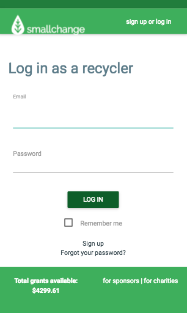

# README 

# small-change
8-day, 4-person capstone project. A proposed mobile-first app paying recyclers micropayments for submitting information about their recycling. Utilized Ruby on Rails, Devise gem, Amazon
s3, Paperclip gem, Materialize.

* Ruby version
2.2.4

Please note that this is a mock project and the donors listed have not actually contributed to this app.

## screenshots
 

 

 

 
